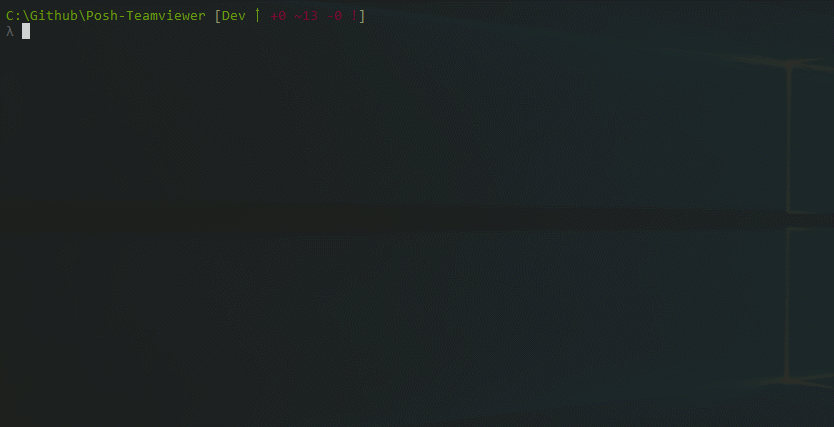

[](https://ci.appveyor.com/project/gerane/posh-teamviewer/branch/master)
[](http://posh-teamviewer.readthedocs.io/en/latest/?badge=latest)

# Posh-Teamviewer Module

The Teamviewer PowerShell Module allows users to connect and edit device properties using the Teamviewer API. Online Documentation can be found on [ReadTheDocs](https://readthedocs.org/projects/posh-teamviewer/)

## Installation

Install from PSGallery.

```powershell
PS> Install-Module -Name Posh-Teamviewer
```

## Set Access Token

To get started create a Teamviewer script Access Token. For detailed insctructions follow this guide: [Create Script](https://integrate.teamviewer.com/en/develop/api/get-started/#createScript). You can also find the full API Documentation here: [API Documentation](https://integrate.teamviewer.com/en/develop/api/documentation/). Once you have your Access Token, use the command `Set-TeamviewerAccessToken` to store the Access Token and set the variable `$Global:TeamviewerAccessToken`. This command encrypts the AccessToken in a file located at `$env:APPDATA\Teamviewer` using PBKDF2 to derive a key with a Master Password and salt. Special thanks to [Carlos Perez](https://github.com/darkoperator) for the Code and Help associated with this. Here is an example of Setting the Access Token.

```powershell
PS> Set-TeamviewerAccessToken -AccessToken '1234-SWDwf23vawef4122345asfg'
```



## Load Saved Access Token

To Load an encrypted Access Token into the Current Session, run the following Command:

```powershell
PS> Initialize-Teamviewer -MasterPassword (Read-Host -AsSecureString)
```

This command will set the following variables:

* **$Global:TeamviewerAccessToken** - The Teamviewer Access Token.
* **$Global:TeamviewerConfigPath** - The Path to the Teamviewer Appdata Folder.
* **$Global:TeamviewerDeviceList** - A stored list of Device Details from the Teamviewer API.

> **NOTE:** Teamviewer requires a Device ID to query that devices information. When **Initialize-Teamviewer** is used at the start of a session, it runs **Set-TeamviewerDeviceList** in the background to build an initial list of Device Details. This is to help in situations where an account has a very large number of devices attached to it. Responses could take upwards of 30 or more seconds when gathering information on thousdands of devices. **Initialize-Teamviewer** may run slightly longer than expected due to this, but keeps the time of the other commands to a minimum.

## Updating the Device List

The first way To update the Device List is to use **Update-DeviceList**. If you need the Device Information to be up to date before running a specific command that relies on this list, a switch parameter `-UpdateDeviceList` is available that will update the List at the beginning of the command.

## Commands and Command Help

| Command                       | Help                                                                            |
|-------------------------------|---------------------------------------------------------------------------------|
| **Connect-Teamviewer**        | [Connect-Teamviewer.md](docs/Commands/Connect-Teamviewer.md)                    |
| **Initialize-Teamviewer**     | [Initialize-Teamviewer.md](docs/Commands/Initialize-Teamviewer.md)              |
| **Set-TeamviewerAccessToken** | [Set-TeamviewerAccessToken.md](docs/Commands/Set-TeamviewerAccessToken.md)      |
| **Set-TeamviewerDeviceList**  | [Set-TeamviewerDeviceList.md](docs/Commands/Set-TeamviewerDeviceList.md)        |
| **Update-TeamviewerDevice**   | [Update-TeamviewerDevice.md](docs/Commands/Update-TeamviewerDevice.md)          |


## Links

- PSGallery - [Posh-Teamviewer]()
- Github - [Brandon Padgett](https://github.com/gerane)
- Twitter - [@brandonpadgett](https://twitter.com/BrandonPadgett)
- Website - [BrandonPadgett.com](http://brandonpadgett.com)
- Documentation - [ReadTheDocs](https://readthedocs.org/projects/posh-teamviewer/)


## License

[MIT](LICENSE)


## Notes

* [Carlos Perez](https://twitter.com/Carlos_Perez) for the ApiKey Encryption work.
* [Stefan Stranger](https://twitter.com/sstranger) for giving me some ideas, whether he realized it or not.
* [Warren Frame](https://twitter.com/psCookieMonster) for his awesome [PSDeploy](https://github.com/RamblingCookieMonster/PSDeploy) Module.
* [June Blender](https://twitter.com/juneb_get_help) for her [Module Help Pester Tests](https://github.com/juneb/PowerShellHelpDeepDive)
